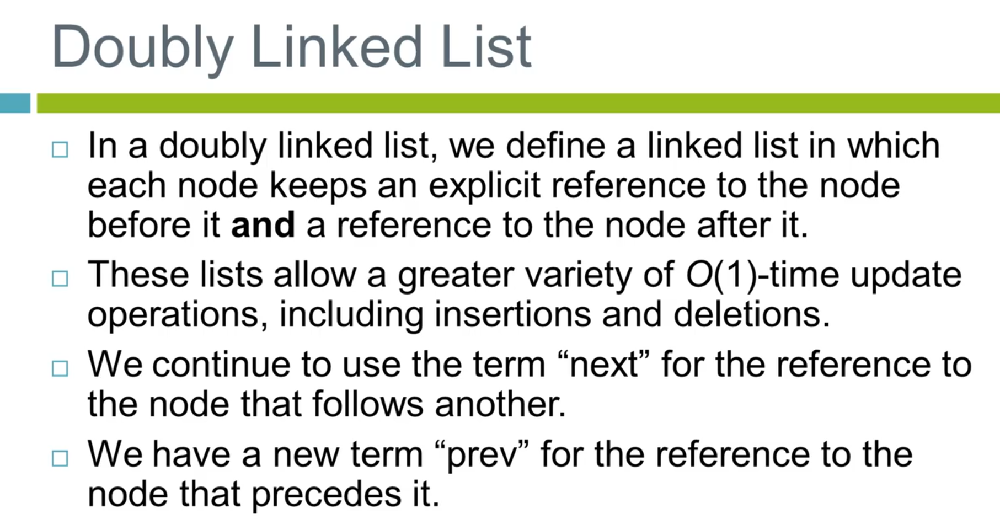
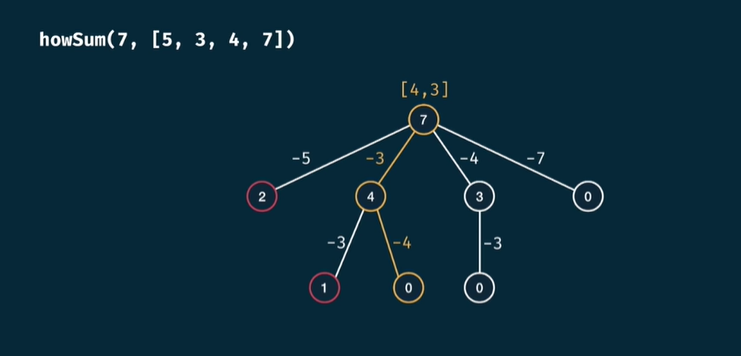

# Interview Quicklook

---

## Big-O Notation

### Different Charts

<details>

  <summary>Complexity Chart</summary>


</details>

<details>

  <summary>Common Data Structure Operations</summary>


</details>

<details>

  <summary>Various Sorting Algorithms</summary>


</details>

<details>

  <summary>Python List Big-O Complexity</summary>


</details>

<details>

  <summary>Python Dictionary Big-O Complexity</summary>


</details>

<details>

  <summary>Ploting</summary>

```py
import math
from matplotlib import pyplot
import numpy as np

pyplot.style.use('bmh')

# Setup runtime comparisions
n = np.linspace(1, 10, 1000)
labels = ['Constant', 'Logarithmic', 'Linear', 'Log Linear', 'Quadratic', 'Cubic', 'Exponential']
big_o = [np.ones(n.shape), np.log(n), n, n*np.log(n), n**2, n**3, 2**n]

# Plot setup
pyplot.figure(figsize=(12, 10))
pyplot.ylim(0, 50)
for i in range(len(big_o)):
  pyplot.plot(n, big_o[i], label=labels[i])

pyplot.legend(loc=0)
pyplot.ylabel('Relative Runtime')
pyplot.xlabel('n')
```


</details>

---

## Array

### Dynamic Array

<details>

  <summary>Own Implementation</summary>

```py
import ctypes

class DynamicArray(object):

  def __init__(self):
      self.index = 0
      self.size = 0
      self.capacity = 1
      self.array = self.make_array(self.capacity)

  def __len__(self):
      return self.size

  def __getitem__(self, k):
      if not 0 <= k < self.size:
          raise IndexError('Out of bounds!')
      return self.array[k]

  def append(self, element):
      if self.size == self.capacity:
          self._resize(2 * self.capacity)

      self.array[self.size] = element
      self.size += 1

  def _resize(self, new_cap):
      temp_array = self.make_array(new_cap)
      for k in range(self.size):
          temp_array[k] = self.array[k]
      self.array = temp_array
      self.capacity = new_cap

  def make_array(self, new_cap):
      return (new_cap * ctypes.py_object)()

  def __iter__(self):
      return self

  def __next__(self):
      if self.index > self.size:
          raise StopIteration
      else:
          item = self.array[self.index]
          self.index += 1
          return item
```

</details>

### Amortized Analysis

<details>

  <summary>Cost of successive appends on a list</summary>


</details>

### Problems

<details>

  <summary>Anagram Check</summary>

#### Problem

Given two strings, check to see if they are anagrams. An anagram is when the two strings can be written using the exact same letters (so you can just rearrange the letters to get a different phrase or word).

For example:

"public relations" is an anagram of "crap built on lies."

"clint eastwood" is an anagram of "old west action"

Note: Ignore spaces and capitalization. So "d go" is an anagram of "God" and "dog" and "o d g".

#### Solution

**Solution by Sorting**

```py
  def sol_anagram_sorting(string1: str, string2: str) -> bool:
    string1 = string1.replace(' ', '').lower()
    string2 = string2.replace(' ', '').lower()

    return sorted(string1) == sorted(string2)
```

**By using Dictionary**

```py
import string
def sol_anagram(string1: str, string2: str) -> bool:
    string1 = string1.replace(' ', '').lower()
    string2 = string2.replace(' ', '').lower()

    if len(string1) != len(string2): return False

    dict1 = dict.fromkeys(string.ascii_lowercase, 0)
    dict2 = dict.fromkeys(string.ascii_lowercase, 0)
    for char in string1: dict1[char] += 1
    for char in string2: dict2[char] += 1

    for (key, value) in dict1.items():
        if dict2[key] != value: return False

    return True
```

**Output**


</details>

<details>

  <summary>Array Pair Sum</summary>

#### Problem

Given an integer array, output all the unique pairs that sum up to a specific value k.

So the input:

pair_sum([1,3,2,2],4)

would return 2 pairs:

(1,3)
(2,2)

NOTE: FOR TESTING PURPOSES CHANGE YOUR FUNCTION SO IT OUTPUTS THE NUMBER OF PAIRS

#### Solution

**Using Set Method**

```py
def sol_pair_sum_set(array: 'list[int]', value: int) -> int:
    if len(array) < 2: return -1
    seen = set()
    output = set()

    for num in array:
        target = value - num
        if target not in seen:
            seen.add(num)
        else:
            output.add((min(target, num), max(target, num)))
    return len(output)
```

**Scratch Method**

```py
def sol_pair_sum(array: [int], value: int) -> int:
    array.sort()
    sindex = 0
    eindex = len(array) - 1
    count = 0
    while sindex < eindex:
        current_value = array[sindex] + array[eindex]
        if current_value > value:
            eindex -= 1
        elif current_value < value:
            sindex += 1
        else:
            count += 1
            sindex += 1
            eindex -= 1
    return count
```

**Output**


</details>

<details>

  <summary>Find the Missing Element</summary>

#### Problem

Consider an array of non-negative integers. A second array is formed by shuffling the elements of the first array and deleting a random element. Given these two arrays, find which element is missing in the second array.

Here is an example input, the first array is shuffled and the number 5 is removed to construct the second array.

Input:

finder([1,2,3,4,5,6,7],[3,7,2,1,4,6])

Output:

5 is the missing number

#### Solution

**Using Sorting**

```py
def sol_find_missing_sort(array1: 'list[int]', array2: 'list[int]') -> int:
    array1.sort()
    array2.sort()

    for num1, num2 in zip(array1, array2):
        if num1 != num2:
            return num1
    return num1[-1]
```

**Using Hashing**

```py
def sol_find_missing_hash(array1: 'list[int]', array2: 'list[int]') -> int:
    count = dict()
    for item in array2:
        if item not in count:
            count[item] = 1
        else:
            count[item] += 1

    for item in array1:
        if item not in count:
            return item

        elif count[item] == 0:
            return item

        else:
            count[item] -= 1
```

**Ouput**


</details>

<details>

  <summary>Largest Continuous Sum</summary>

#### Problem

Given an array of integers (positive and negative) find the largest continuous sum.

#### Solution

**Kadane's Algorithm**

```py
def large_cont_sum(array: 'list[int]') -> int:
    if len(array) == 0: return 0

    max_sum = current_max = array[0]

    for num in array[1:]:
        current_max = max(current_max + num, num)
        max_sum = current_max if current_max > max_sum else max_sum

    return max_sum
```

**Output**


</details>

<details>

  <summary>Sentence Reversal</summary>

#### Problem

Given a string of words, reverse all the words. For example:

Given:

'This is the best'

Return:

'best the is This'

As part of this exercise you should remove all leading and trailing whitespace. So that inputs such as:

' space here' and 'space here '

both become:

'here space'

#### Solution

**Scratch Method**

```py
def sol_rev_word_scratch(string: str) -> str:
    words = []
    i = 0
    size = len(string)
    space = ' '
    while i < size:
        if string[i] is not space:
            start_index = i
            while i < size and string[i] is not space:
                i += 1
            words.append(string[start_index : i])
        i += 1

    start = 0
    end = len(words) - 1
    while start < end:
        temp = words[start]
        words[start] = words[end]
        words[end] = temp
        start += 1
        end -= 1

    result = ''
    for i in range(len(words)):
        result += (words[i] + ' ') if i != len(words) - 1 else (words[i])
    return result
```

**Pythonic Way**

```py
def sol_rev_word(string: str) -> str:
    return ' '.join(reversed(string.strip(' ').split()))
```

**Output**


</details>

<details>

  <summary>String Compression</summary>

#### Problem

Given a string in the form 'AAAABBBBCCCCCDDEEEE' compress it to become 'A4B4C5D2E4'. For this problem, you can falsely "compress" strings of single or double letters. For instance, it is okay for 'AAB' to return 'A2B1' even though this technically takes more space.

The function should also be case sensitive, so that a string 'AAAaaa' returns 'A3a3'.

#### Solution

```py
def sol_compress(string: str) -> str:
    size = len(string)

    if size == 0: return ''

    if size == 1: return string[0] + '1'

    result = ''
    count = 1
    i = 1

    while i < size:
        if string[i] == string[i - 1]:
            count += 1
        else:
            result += (string[i-1] + str(count))
            count = 1
        i += 1

    result += (string[i-1] + str(count))
    return result
```

**Output**


</details>

<details>

  <summary>Unique Characters in String</summary>

#### Problem

Given a string,determine if it is compreised of all unique characters. For example, the string 'abcde' has all unique characters and should return True. The string 'aabcde' contains duplicate characters and should return false.

#### Solution

**One liner Set Method**

```py
def sol_uni_char(string: str) -> bool:
    return len(set(string)) == len(string)
```

**Lookup Scratch**

```py
def sol_uni_char_look(string: str) -> bool:
    str_set = set()
    for char in string:
        if char in str_set:
            return False
        else:
            str_set.add(char)
    return True
```

**Output**


</details>

---

## Stack, Queue, Deque

### What is a Stack


> LIFO Principle

<details>

  <summary>Overview</summary>

A stack is an ordered collection of items where the addition of new items and the removal of existing items always takes place at the same end. This end is commonly referred to as the “top.” The end opposite the top is known as the “base.”

The base of the stack is significant since items stored in the stack that are closer to the base represent those that have been in the stack the longest. The most recently added item is the one that is in position to be removed first.

This ordering principle is sometimes called LIFO, last-in first-out. It provides an ordering based on length of time in the collection. Newer items are near the top, while older items are near the base.

For example, consider the figure below:


Note how the first items "pushed" to the stack begin at the base, and as items are "popped" out. Stacks are fundamentally important, as they can be used to reverse the order of items. The order of insertion is the reverse of the order of removal.

Considering this reversal property, you can perhaps think of examples of stacks that occur as you use your computer. For example, every web browser has a Back button. As you navigate from web page to web page, those pages are placed on a stack (actually it is the URLs that are going on the stack). The current page that you are viewing is on the top and the first page you looked at is at the base. If you click on the Back button, you begin to move in reverse order through the pages.

</details>

<details>

  <summary>Stack Implementation</summary>

Before we implement our own Stack class, let's review the properties and methods of a Stack.

The stack abstract data type is defined by the following structure and operations. A stack is structured, as described above, as an ordered collection of items where items are added to and removed from the end called the “top.” Stacks are ordered LIFO. The stack operations are given below.

- Stack() creates a new stack that is empty. It needs no parameters and returns an empty stack.
- push(item) adds a new item to the top of the stack. It needs the item and returns nothing.
- pop() removes the top item from the stack. It needs no parameters and returns the item. The stack is modified.
- peek() returns the top item from the stack but does not remove it. It needs no parameters. The stack is not modified.
- isEmpty() tests to see whether the stack is empty. It needs no parameters and returns a boolean value.
- size() returns the number of items on the stack. It needs no parameters and returns an integer.

```py
class Stack(object):
  def __init__(self):
      self.items = []

  def is_empty(self):
      return len(self) == 0

  def push(self, item):
      self.items.append(item)

  def pop(self):
      return self.items.pop()

  def peek(self):
      return self.items[-1]

  def size(self):
      return len(self.items)

  def __len__(self):
      return len(self.items)

  def __iter__(self):
      self.index = 0
      return self

  def __next__(self):
      if self.index < 0 or self.index > len(self):
          raise StopIteration
      else:
          item =  self.items[-1 * (index + 1)]
          self.index += 1
          return item

  def __getitem__(self, index):
      return self.items[index]

  def __repr__(self):
      return ', '.join([str(item) for item in self.items])
```

</details>

### What is a Queue


> FIFO Principle

<details>

  <summary>Overview</summary>

A queue is an ordered collection of items where the addition of new items happens at one end, called the “rear,” and the removal of existing items occurs at the other end, commonly called the “front.” As an element enters the queue it starts at the rear and makes its way toward the front, waiting until that time when it is the next element to be removed.

The most recently added item in the queue must wait at the end of the collection. The item that has been in the collection the longest is at the front. This ordering principle is sometimes called FIFO, first-in first-out. It is also known as “first-come first-served.”

The simplest example of a queue is the typical line that we all participate in from time to time. We wait in a line for a movie, we wait in the check-out line at a grocery store, and we wait in the cafeteria line. The first person in that line is also the first person to get serviced/helped.

Let's see a diagram which shows this and compares it to the Stack Data Structure:


Note how we have two terms here, Enqueue and Dequeue. The enqueue term describes when we add a new item to the rear of the queue. The dequeue term describes removing the front item from the queue.

</details>

<details>

  <summary>Queue Implementation</summary>

Before we begin implementing our own queue, let's review the attribute and methods it will have:

- Queue() creates a new queue that is empty. It needs no parameters and returns an empty queue.
- enqueue(item) adds a new item to the rear of the queue. It needs the item and returns nothing.
- dequeue() removes the front item from the queue. It needs no parameters and returns the item. The queue is modified.
- isEmpty() tests to see whether the queue is empty. It needs no parameters and returns a boolean value.
- size() returns the number of items in the queue. It needs no parameters and returns an integer.

```py
class Queue(object):

    def __init__(self):
        self.items = []

    def is_empty(self):
        return len(self.items) == 0

    def enqueue(self, item):
        self.items.insert(0, item)

    def dequeue(self):
        return self.items.pop()

    def size(self):
        return len(self.items)

    def __getitem__(self, index):
        return self.items[index]

    def __iter__(self):
        self.index = 0
        return self

    def __next__(self):
        if self.index < 0 or self.index > len(self.items) - 1:
            raise StopIteration
        else:
            item = self.items[self.index]
            self.index += 1
            return item

    def __repr__(self):
        return 'Back => ' + ', '.join([str(item) for item in self]) + ' => Front'
```

</details>

### What is a Deque


> Insertion and Removal on either end

<details>

  <summary>Overview</summary>

A deque, also known as a double-ended queue, is an ordered collection of items similar to the queue. It has two ends, a front and a rear, and the items remain positioned in the collection. What makes a deque different is the unrestrictive nature of adding and removing items. New items can be added at either the front or the rear. Likewise, existing items can be removed from either end. In a sense, this hybrid linear structure provides all the capabilities of stacks and queues in a single data structure.

It is important to note that even though the deque can assume many of the characteristics of stacks and queues, it does not require the LIFO and FIFO orderings that are enforced by those data structures. It is up to you to make consistent use of the addition and removal operations.

Let's see an Image to visualize the Deque Data Structure:


Note how we can both add and remove from the front and the back of the Deque.

</details>

<details>

  <summary>Deques Implementation</summary>

```py
class Deque(object):

    def __init__(self):
        self.items = []

    def add_front(self, item):
        self.items.append(item)

    def add_rear(self, item):
        self.items.insert(0, item)

    def remove_front(self):
        self.items.pop()

    def remove_rear(self):
        self.items.pop(0)

    def is_empty(self):
        return len(self.items) == 0

    def size(self):
        return len(self.items)

    def __getitem__(self, index):
        return self.items[index]

    def __iter__(self):
        self.index = 0
        return self

    def __next__(self):
        if self.index < 0 or self.index > len(self.items) - 1:
            raise StopIteration
        else:
            item = self.items[self.index]
            self.index += 1
            return item

    def __repr__(self):
        return 'Back => ' + ', '.join([str(item) for item in self]) + ' => Front'
```

</details>

### Problems

<details>

  <summary>Balanced Parentheses Check</summary>

#### Problem

Given a string of opening and closing parentheses, check whether it’s balanced. We have 3 types of parentheses: round brackets: (), square brackets: [], and curly brackets: {}. Assume that the string doesn’t contain any other character than these, no spaces words or numbers. As a reminder, balanced parentheses require every opening parenthesis to be closed in the reverse order opened. For example ‘([])’ is balanced but ‘([)]’ is not.

You can assume the input string has no spaces.

#### Solution

This is a very common interview question and is one of the main ways to check your knowledge of using Stacks! We will start our solution logic as such:

First we will scan the string from left to right, and every time we see an opening parenthesis we push it to a stack, because we want the last opening parenthesis to be closed first. (Remember the FILO structure of a stack!)

Then, when we see a closing parenthesis we check whether the last opened one is the corresponding closing match, by popping an element from the stack. If it’s a valid match, then we proceed forward, if not return false.

Or if the stack is empty we also return false, because there’s no opening parenthesis associated with this closing one. In the end, we also check whether the stack is empty. If so, we return true, otherwise return false because there were some opened parenthesis that were not closed.

**Lengthy Method**

```py
from collections import deque

def sol_balance_check(string: str) -> bool:
    if len(string) % 2 != 0:
        return False

    open_parens = ['(', '{', '[']
    close_parens = [')', '}', ']']
    paren_stack = deque()

    for char in string:
        if char in open_parens:
            paren_stack.append(char)
        elif char in close_parens:
            open_index = open_parens.index(paren_stack[-1])
            close_index = close_parens.index(char)
            if open_index == close_index:
                paren_stack.pop()
            else:
                return False

    if len(paren_stack) != 0:
        return False
    return True
```

**Simple Method**

```py
from collections import deque
def sol_balance_check_easy(string: str) -> bool:
    if len(string) % 2 != 0:
        return False

    open_parens = set(['(', '[', '{'])
    close_parens = set([')', ']', '}'])
    pair_parens = set([('(', ')'), ('{', '}'), ('[', ']')])

    stack = deque()

    for char in string:
        if char in open_parens:
            stack.append(char)
        elif char in close_parens:
            if (stack.pop(), char) not in pair_parens:
                return False

    return len(stack) == 0
```

**Output**


</details>

<details>

  <summary>Implement a Queue - Using Two Stacks</summary>

#### Problem

Given the Stack class below, implement a Queue class using two stacks! Note, this is a "classic" interview problem. Use a Python list data structure as your Stack.

#### Solution

The key insight is that a stack reverses order (while a queue doesn't). A sequence of elements pushed on a stack comes back in reversed order when popped. Consequently, two stacks chained together will return elements in the same order, since reversed order reversed again is original order.

We use an in-stack that we fill when an element is enqueued and the dequeue operation takes elements from an out-stack. If the out-stack is empty we pop all elements from the in-stack and push them onto the out-stack.

```py
from collections import deque

class Dequeu(object):

    def __init__(self):
        self.in_stack = deque()
        self.out_stack = deque()

    def enqueue(self, item):
        self.in_stack.append(item)

    def deque(self):
        if len(self.out_stack) == 0:
            self.transfer()
        return self.out_stack.pop()

    def transfer(self):
        while (self.in_stack) is not 0:
            self.out_stack.append(self.in_stack.pop())
```

**Output**


</details>

---

## Linked List

### What is Linked List


<details>

  <summary>Overview</summary>

Remember, in a singly linked list, we have an ordered list of items as individual Nodes that have pointers to other Nodes.

In a Linked List the first node is called the head and the last node is called the tail. Let's discuss the pros and cons of Linked Lists:

#### Pros

Linked Lists have constant-time insertions and deletions in any position, in comparison, arrays require O(n) time to do the same thing.

Linked lists can continue to expand without having to specify their size ahead of time (remember our lectures on Array sizing form the Array Sequence section of the course!)

#### Cons

To access an element in a linked list, you need to take O(k) time to go from the head of the list to the kth element. In contrast, arrays have constant time operations to access elements in an array.

</details>

<details>

  <summary>Implementation of a Node</summary>

```py
class Node(object):

  def __init__(self, value, next = None):
      self.value = value
      self.next = None

  def __repr__(self):
      result = f'(Node: {self.value}) -> '
      if self.next is None:
          result += 'None'
      else:
          result += str(self.next)
      return result
```

</details>

### What is Doubly Linked List



<details>

  <summary>Implementation of Doubly Linked List</summary>

```py
 class DoublyNode(object):

    def __init__(self, value, prev = None, next = None):
        self.value = value
        self.next = next
        self.prev = prev
    def __repr__(self):
        result = f'Node: {self.value} <=> '
        if self.next is None:
            result += 'None'
        else:
            result += str(self.next)
        return result
```

</details>

### Problems

<details>

  <summary>Singly Linked List Cycle Check</summary>

#### Problem

Given a singly linked list, write a function which takes in the first node in a singly linked list and returns a boolean indicating if the linked list contains a "cycle".

A cycle is when a node's next point actually points back to a previous node in the list. This is also sometimes known as a circularly linked list.

#### Solution

To solve this problem we will have two markers traversing through the list. marker1 and marker2. We will have both makers begin at the first node of the list and traverse through the linked list. However the second marker, marker2, will move two nodes ahead for every one node that marker1 moves.

By this logic we can imagine that the markers are "racing" through the linked list, with marker2 moving faster. If the linked list has a cycle and is circularly connected we will have the analogy of a track, in this case the marker2 will eventually be "lapping" the marker1 and they will equal each other.

If the linked list has no cycle, then marker2 should be able to continue on until the very end, never equaling the first marker.

```py
def cycle_check(node: Node) -> bool:
    marker1 = node
    marker2 = node

    while marker1 != None and marker2.next != None:
        marker1 = marker1.next
        marker2 = marker2.next.next

        if marker1 == marker2:
            return True
    return False
```

</details>

<details>

  <summary>Reverse a Linked List</summary>

#### Problem

Write a function to reverse a Linked List in place. The function will take in the head of the list as input and return the new head of the list.

You are given the example Linked List Node class:

#### Solution

Since we want to do this in place we want to make the function operate in O(1) space, meaning we don't want to create a new list, so we will simply use the current nodes! Time wise, we can perform the reversal in O(n) time.

We can reverse the list by changing the next pointer of each node. Each node's next pointer should point to the previous node.

In one pass from head to tail of our input list, we will point each node's next pointer to the previous element.

```py
def reverse_linked_list(head: Node) -> None:
    current_node = head
    prev_node = None
    next_node = None

    # Until we have gone through the end of the list
    while current_node is not None:
        # Copy the current_node's next to next_node
        next_node = current_node.next

        # Reverse the pointer of the next_node
        current_node.next = prev_node

        # Go one forward in the list
        prev_node = current_node
        current_node = next_node

    return prev_node
```

</details>

<details>

  <summary>Linked List Nth to Last Node</summary>

#### Problem

Write a function that takes a head node and an integer value n and then returns the nth to last node in the linked list. For example, given:

#### Solution

One approach to this problem is this:

Imagine you have a bunch of nodes and a "block" which is n-nodes wide. We could walk this "block" all the way down the list, and once the front of the block reached the end, then the other end of the block would be a the Nth node!

So to implement this "block" we would just have two pointers a left and right pair of pointers. Let's mark out the steps we will need to take:

- Walk one pointer n nodes from the head, this will be the right_point
- Put the other pointer at the head, this will be the left_point
- Walk/traverse the block (both pointers) towards the tail, one node at a time, keeping a distance n between them.
- Once the right_point has hit the tail, we know that the left point is at the target.

Let's see the code for this!

```py
def nth_to_last_node(n: int, head: Node) -> Node:
    r_node = l_node = head
    for i in range(n - 1):
        if r_node.next == None:
            raise LookupError('Error: n > size of linked list')
        else:
            r_node = r_node.next

    while r_node.next != None:
        r_node = r_node.next
        l_node = l_node.next

    return l_node
```

</details>

---

## Recursion


### Problems

<details>

  <summary>Problem 1</summary>

#### Problem

Write a recursive function which takes an integer and computes the cumulative sum of 0 to that integer

For example, if n=4 , return 4+3+2+1+0, which is 10.

This problem is very similar to the factorial problem presented during the introduction to recursion. Remember, always think of what the base case will look like. In this case, we have a base case of n =0 (Note, you could have also designed the cut off to be 1).

In this case, we have: n + (n-1) + (n-2) + .... + 0

#### Solution

```py
def rec_sum(n):
    if n == 0:
        return 0
    else:
        return n + rec_sum(n - 1)

# Testing
rec_sum(4)
```

</details>

<details>

  <summary>Problem 2</summary>

#### Problem

Given an integer, create a function which returns the sum of all the individual digits in that integer. For example: if n = 4321, return 4+3+2+1

#### Solution

```py
def sum_func(n):
    if n == 0:
        return 0
    return n % 10 + sum_func(n // 10)

# Testing
sum_func(4321)
```

</details>

<details>

  <summary>Problem 3</summary>

#### Problem

Note, this is a more advanced problem than the previous two! It aso has a lot of variation possibilities and we're ignoring strict requirements here.

Create a function called word_split() which takes in a string phrase and a set list_of_words. The function will then determine if it is possible to split the string in a way in which words can be made from the list of words. You can assume the phrase will only contain words found in the dictionary if it is completely splittable.

#### Solution

```py
def word_split(string: str, words: 'list[str]') -> bool:
    if len(string) == 0:
        return True
    for word in words:
        if string[:len(word)] == word:
            return word_split(string[ len(word): ], words)
    return False

# Testing
word_split('themanran',['the','ran','man'])
word_split('ilovedogsJohn',['i','am','a','dogs','lover','love','John'])
word_split('themanran',['clown','ran','man'])
```

</details>

### Memoization

We will discuss memoization and dynamic programming. For your homework assignment, read the Wikipedia article on Memoization, before continuing on with this lecture!

Memoization effectively refers to remembering ("memoization" -> "memorandum" -> to be remembered) results of method calls based on the method inputs and then returning the remembered result rather than computing the result again. You can think of it as a cache for method results. We'll use this in some of the interview problems as improved versions of a purely recursive solution.

A simple example for computing factorials using memoization in Python would be something like this:

```py
# Create cache for known results
factorial_memo = {}

def factorial(k):

    if k < 2:
        return 1

    if not k in factorial_memo:
        factorial_memo[k] = k * factorial(k-1)

    return factorial_memo[k]
```

Note how we are now using a dictionary to store previous results of the factorial function! We are now able to increase the efficiency of this function by remembering old results!

Keep this in mind when working on the Coin Change Problem and the Fibonacci Sequence Problem.

We can also encapsulate the memoization process into a class:

```py
class Memoize:
    def __init__(self, f):
        self.f = f
        self.memo = {}
    def __call__(self, *args):
        if not args in self.memo:
            self.memo[args] = self.f(*args)
        return self.memo[args]
```

Then all we would have to do is:

```py
def factorial(k):

    if k < 2:
        return 1

    return k * factorial(k - 1)

factorial = Memoize(factorial)
```

Try comparing the run times of the memoization versions of functions versus the normal recursive solutions!

### Problems

<details>

  <summary>String Reversal</summary>

#### Problem

This interview question requires you to reverse a string using recursion. Make sure to think of the base case here.

Again, make sure you use recursion to accomplish this. Do not slice (e.g. string[::-1]) or use iteration, there muse be a recursive call for the function.

#### Solution

In order to reverse a string using recursion we need to consider what a base and recursive case would look like. Here we've set a base case to be when the length of the string we are passing through the function is length less than or equal to 1.

During the recursive case we grab the first letter and add it on to the recursive call.

```py
def reverse(string: str) -> str:
    if len(string) is 0: return ''
    return reverse(string[1:]) + string[0]

# Testing
reverse('hello world')
```

</details>

<details>

  <summary>String Permutation</summary>

#### Problem

Given a string, write a function that uses recursion to output a list of all the possible permutations of that string.

For example, given s='abc' the function should return ['abc', 'acb', 'bac', 'bca', 'cab', 'cba']

Note: If a character is repeated, treat each occurence as distinct, for example an input of 'xxx' would return a list with 6 "versions" of 'xxx'

#### Solution

```py
def permute(string: str) -> 'list[str]':
    output = []

    # Base Case
    if len(string) == 1:
        return [string]

    # for every letter in string
    for i, let in enumerate(string):
        for perm in permute(string[:i] + string[i+1:]):
            output += [let + perm]

    return output
```

**Conclusion**

There were two main takeaways from tackling this problem:

- Every time we put a new letter in position i, we then had to find all the possible combinations at position i+1 – this was the recursive call that we made. How do we know when to save a string? When we are at a position i that is greater than the number of letters in the input string, then we know that we have found one valid permutation of the string and then we can add it to the list and return to changing letters at positions less than i. This was our base case – remember that we always must have a recursive case and a base case when using recursion!
- Another big part of this problem was figuring out which letters we can put in a given position. Using our sample string “abc”, lets say that we are going through all the permutations where the first letter is "c”. Then, it should be clear that the letter in the 2nd and 3rd position can only be either “a” or “b”, because “a” is already used. As part of our algorithm, we have to know which letters can be used in a given position – because we can’t reuse the letters that were used in the earlier positions.

</details>

<details>

  <summary>Fibonacci Different Ways!</summary>

#### Problem

Implement a Fibonnaci Sequence in three different ways:

Recursively
Dynamically (Using Memoization to store results)
Iteratively
Remember that a fibonacci sequence: 0,1,1,2,3,5,8,13,21,... starts off with a base case checking to see if n = 0 or 1, then it returns 1.

Else it returns fib(n-1)+fib(n+2).

#### Solution

**Recursively**

The recursive solution is exponential time Big-O , with O(2^n). However, its a very simple and basic implementation to consider:

```py
def fib_rec(num: int) -> int:
    if (num < 2): return num
    return fib_rec(num - 1) + fib_rec(num - 2)

# Testing
fib_rec(10)
```

**Dynamically**

In the form it is implemented here, the cache is set beforehand and is based on the desired n number of the Fibonacci Sequence. Note how we check it the cache[n] != None, meaning we have a check to know wether or not to keep setting the cache (and more importantly keep cache of old results!)

```py
def fib_dyn(num: int, memo = dict()) -> int:
    if num < 2:
        return num
    if num in memo:
        return memo.get(num)

    ans = fib_dyn(num - 1, memo) + fib_dyn(num - 2, memo)
    memo[num] = ans

    return ans

# Testing
fib_dyn(10)
```

**Iteratively**

```py
def fib_iter(num: int) -> int:
    prev = 0
    cur = 1

    for i in range(num):
        prev, cur = cur, prev + cur

    return prev
```

</details>

<details>

  <summary>Coin Change Problem</summary>

#### Problem

This problem has multiple solutions and is a classic problem in showing issues with basic recursion. There are better solutions involving memoization and simple iterative solutions.If you are having trouble with this problem (or it seems to be taking a long time to run in some cases) check out the Solution Notebook and fully read the conclusion link for a detailed description of the various ways to solve this problem!

This is a classic recursion problem: Given a target amount n and a list (array) of distinct coin values, what's the fewest coins needed to make the change amount.

For example:

If n = 10 and coins = [1,5,10]. Then there are 4 possible ways to make change:

1+1+1+1+1+1+1+1+1+1

5 + 1+1+1+1+1

5+5

10

With 1 coin being the minimum amount.

#### Solution

**Recursive Solution**

```py
def rec_coin(target: int, coins: 'list[int]') -> int:
    if target == 0:
        return 0

    if target < 0:
        return float('inf')

    min_coins = float('inf')

    for coin in coins:
        num_coins = 1 + rec_coin(target - coin, coins)
        if num_coins < min_coins:
            min_coins = num_coins

    return min_coins
```

**Memoization Solution**

```py
def rec_coin_dynamic(target: int, coins: 'list[int]', memo = dict()) -> int:
    if target == 0:
        return 0

    if target < 0:
        return float('inf')

    if target in memo:
        return memo.get(target)

    min_coins = float('inf')

    for coin in coins:
        num_coins = rec_coin_dynamic(target - coin, coins, memo) + 1

        if num_coins < min_coins:
            min_coins = num_coins

    memo[target] = min_coins
    return min_coins
```

</details>

---

## Dynamic Programming

### Memoization Recipe

<details>

  <summary>Make it work</summary>

- visualize the problem
- implement the tree using recursion
- test it

</details>

<details>

  <summary>Make it efficient</summary>

- add a memo object
- add a base case to return memo values
- store return values into the memo

</details>

### Fibonacci Problem

<details>

  <summary>Solution and Complexity</summary>

| Time   | Space  |
| ------ | ------ |
| $O(n)$ | $O(n)$ |

**Fibo Tree**


**Python Code**

```py
def fib_rec(num: int, memo = dict()) -> int:
    if num < 2:
        return num
    if num in memo:
        return memo.get(num)

    ans = fib_rec(num - 1, memo) + fib_rec(num - 2, memo)
    memo[num] = ans
    return ans
```

</details>

### Grid Traveler Problem

<details>

  <summary>Solution and Complexity</summary>

|             | Time         | Space      |
| ----------- | ------------ | ---------- |
| Brute Force | $O(2^{n+m})$ | $O(n + m)$ |
| Memoized    | $O(m * n)$   | $O(n + m)$ |

> n = rows and m = cols

**Grid Traveler Tree**


**Python Code**

```py
  def grid_traveler_rec(rows: int, cols: int, memo = dict()) -> int:
    if rows is 0 or cols is 0:
        return 0
    if rows is 1 and cols is 1:
        return 1

    if f'{rows},{cols}' in memo:
        return memo[f'{rows},{cols}']

    ans = grid_traveler_rec(rows - 1, cols, memo) + grid_traveler_rec(rows, cols - 1, memo)
    memo[f'{rows},{cols}'] = ans
    return ans
```

</details>

### Can Sum

<details>

  <summary>Procedure</summary>

- Write a function **can_sum(target_sum, numbers)** that takes in a **target_sum** and an array of numbers as arguments
- The function should return a boolean indicating whether it is possible to generate the **target_sum** using numbers from the array
- You may use an element of the array as many times as needed
- You may assume that all input numbers are non-negative

</details>

<details>

  <summary>Solution and Complexity</summary>

|             | Time       | Space  |
| ----------- | ---------- | ------ |
| Brute Force | $O(n^m)$   | $O(m)$ |
| Memoized    | $O(m * n)$ | $O(m)$ |

> m = target sum, n = array length

**Can Sum Tree**


**Visualization**


**Python Code**

```py
def can_sum_rec(target: int, nums: int, memo = dict()) -> bool:
    if target == 0:
        return True

    if target < 0:
        return False

    if target in memo:
        return memo.get(target)

    for num in nums:
        if can_sum_rec(target - num, nums, memo):
            memo[target] = True
            return True

    memo[target] = False
    return False
```

</details>

### How Sum

<details>

  <summary>Procedure</summary>

- Write a function **how_sum(target_sum, numbers)** that takes in a target_sum and an array of numbers as arguments
- The function should return an array containing any combination of elements that add up to exactly that **target_sum**. If there is no combination that adds up to the **target_sum**, then return null
- If there are multiple combinations possible, you may return any single one

</details>

<details>

  <summary>Solution and Complexity</summary>

|             | Time         | Space    |
| ----------- | ------------ | -------- |
| Brute Force | $O(n^m + m)$ | $O(m)$   |
| Memoized    | $O(n * m^2)$ | $O(m^2)$ |

> m = target sum, n = array length

**How Sum Tree**



**Visualize**


**Code**

```py
def how_sum_rec(target: int, nums: 'list[int]', memo = dict()) -> 'list[int]':
    if target == 0:
        return []

    if target < 0:
        return None

    if target in memo:
        return memo.get(target)

    for num in nums:
        current = how_sum_rec(target - num, nums, memo)
        if current is not None:
            current.append(num)
            memo[target] = current
            return current
    memo[target] = None
    return None
```

</details>

### Best Sum

<details>

  <summary>Procedure</summary>

- Write a function **best_sum(target_sum, numbers)** that takes in a **target_sum** and an array of numbers an an argument
- The function should return an array containing the **shortest** combination of numbers that add up to exactly the **target_sum**
- If there is a tie for the shortest combination, you may return any one of the shortest

</details>

<details>

  <summary>Solution and Complexity</summary>

|             | Time         | Space    |
| ----------- | ------------ | -------- |
| Brute Force | $O(n^m + m)$ | $O(m^2)$ |
| Memoized    | $O(n * m^2)$ | $O(m^2)$ |

> m = target sum, n = array length

**Best Sum Tree**


**Visualize**


**Python Code**

```py
def best_sum_rec(target: int, nums: 'list[int]', memo = dict()):
    if target == 0:
        return []

    if target < 0:
        return None

    if target in memo:
        return memo.get(target)

    min_array = None
    for num in nums:
        current_array = best_sum_rec(target - num, nums, memo)
        if current_array is not None:
            current_array.append(num)
            if min_array is None:
                min_array = current_array
            elif len(current_array) < len(min_array):
                min_array = current_array
    memo[target] = min_array
    return min_array
```

</details>

### In a Nutshell

- **can_sum => Decision Problem**
  _(can you do it? yes/no)_

  > m = target_sum
  > n = array length

  | Brute Force   | Memoized        |
  | ------------- | --------------- |
  | $O(n^m) time$ | $O(m * n)$ time |
  | $O(m)$ space  | $O(m) space     |

- **how_sum => Combinatoric Problem**
  _(how will you do it?)_

  > m = target_sum
  > n = array lengtized

  | Brute Force       | Memoized          |
  | ----------------- | ----------------- |
  | $O(n^m * m)$ time | $O(n * m^2)$ time |
  | $O(m)$ space      | $O(m^2)$ space    |

- **best_sum => Optimization Problem**
  _(what is the best way to do it?)_

  > m = target_sum
  > n = array length

  | Brute Force       | Memoized          |
  | ----------------- | ----------------- |
  | $O(n^m * m)$ time | $O(n * m^2)$ time |
  | $O(m^2)$ space    | $O(m^2)$ space    |

### Can Construct

<details>

  <summary>Procedure</summary>

- Write a function **can_construct(target, word_bank)** that accepts a target string and an array of strings.
- The function should return a boolean indicating whether the **target** can be constructed by concatenating elements of the **word_bank** as many times as needed.
- You may reuse elements of **word_bank** as many times as needed.

</details>

<details>

  <summary>Solution and Complexity</summary>

|             | Time         | Space    |
| ----------- | ------------ | -------- |
| Brute Force | $O(n^m * m)$ | $O(m^2)$ |
| Memoized    | $O(n * m^2)$ | $O(m^2)$ |

> m = target.length, n = words.length

**Can Construct Tree**


**Visualize**


**Python Code**

```py
def can_construct_rec(target: str, words: 'list[int]', memo = dict()) -> bool:
    if target == '':
        return True

    if target in memo:
        return memo.get(target)

    for word in words:
        if target.startswith(word):
            if can_construct_rec(target[len(word):], words, memo):
                memo[target] = True
                return True
    memo[target] = False
    return False
```

</details>

### Count Construct

<details>

  <summary>Procedure</summary>

- Write a function **count_construct(target, word_bank)** that accepts a target string and an array of strings
- The function should return the number of ways that the **target** can be constructed by concatenating elements of the **word_bank** array
- You may reuse elements of **word_bank** as many times as needed

</details>

<details>

  <summary>Solution and Complexity</summary>

|             | Time         | Space    |
| ----------- | ------------ | -------- |
| Brute Force | $O(n^m * m)$ | $O(m^2)$ |
| Memoized    | $O(n * m^2)$ | $O(m^2)$ |

> m = target.length, n = words.length

**Count Construct Tree**


**Visualize**


**Python Code**

```py
def count_construct_rec(target: str, words: 'list[str]', memo = dict()) -> int:
    if target == '':
        return 1

    if target in memo:
        return memo.get(target)

    count = 0
    for word in words:
        if target.startswith(word):
            count += count_construct_rec(target[len(word):], words)

    memo[target] = count
    return count
```

</details>

### All Construct

<details>

  <summary>Procedure</summary>

- Write a function **all_construct(target, word_bank)** that accepts a target string and an array of strings.
- The function should return a 2D array containing all of the ways that the **targer** can be constructed by concatenating elements of the **word_bank** array. Each element of the 2D array should represent one combination that constructs the **target**.

</details>

<details>

  <summary>Solution and Complexity</summary>

|             | Time     | Space  |
| ----------- | -------- | ------ |
| Brute Force | $O(n^m)$ | $O(m)$ |
| Memoized    | $O(n^m)$ | $O(m)$ |

> m = target.length, n = words.length

**All Construct Tree**


**Visualize**


**Python Code**

```py
def all_construct_rec(target: str, words: 'list[str]', memo = dict()) -> 'list[list[str]]':
    if target == '':
        return [[]]

    if target in memo:
        return memo.get(target)

    result_list = []
    for word in words:
        if target.startswith(word):
            current_2d_list = all_construct_rec(target[len(word):], words)
            for current_1d in current_2d_list:
                current_1d = [word] + current_1d
                result_list.append(current_1d)

    memo[target] = result_list
    return result_list
```

</details>

### Fibonacci Problem (Table)

<details>

  <summary>Solution</summary>

```py
def fib_table(target: int) -> int:
  memo = [None] * max(2, (target + 1))
  memo[0] = 0
  memo[1] = 1
  for num in range(2, target + 1):
      memo[num] = memo[num - 1] + memo[num - 2]

  return memo[target]
```

</details>

### Grid Traveler Problem (Table)

<details>

  <summary>Solution and Complexity</summary>

**Table**


**Visualize**


**Python Code**

```py
def grid_traveler_tab(rows: int, cols: int) -> int:
    memo = [[0] * (cols + 1) for i in range(rows + 1)]
    memo[1][1] = 1
    for i in range (rows + 1):
        for j in range(cols + 1):
            if i + 1 >= 0 and i + 1 <= rows:
                memo[i+1][j] += memo[i][j]
            if j + 1 >= 0 and j + 1 <= cols:
                memo[i][j+1] += memo[i][j]
    return memo[rows][cols]
```

</details>

### Can Sum (Table)

<details>

  <summary>Solution and Complexity</summary>

**Visualize**


**Python Code**

```py
def can_sum_tab(target: int, nums: 'list[int]') -> bool:
    memo = [False] * (target + 1)
    memo[0] = True
    for cur in range(0, target + 1):
        for num in nums:
            if cur + num <= target and memo[cur] == True:
                memo[cur + num] = True
    return memo[target]
```

</details>

### How Sum (Table)

<details>

  <summary>Solution and Complexity</summary>

**Visualize**


**Python Code**

```py
def how_sum_table(target: int, nums: 'list[int]') -> 'list[int]':
    memo = [None] * (target + 1)
    memo[0] = []
    for cur in range(target + 1):
        if memo[cur] is not None:
            for num in nums:
                if cur + num <= target:
                    memo[cur + num] = [num] + [num for num in memo[cur]]
    return memo[target]
```

</details>

### Best Sum (Table)

<details>

  <summary>Solution and Complexity</summary>

**Visualize**


**Python Code**

```py
def best_sum_tab(target: int, nums: 'list[int]') -> 'list[int]':
    memo = [None] * (target + 1)
    memo[0] = []

    for cur in range(target + 1):
        if memo[cur] is not None:
            for num in nums:
                if cur + num <= target:
                    cur_array = [num] + [num for num in memo[cur]]
                    if memo[cur + num] is None or len(memo[cur + num]) > len(cur_array):
                        memo[cur + num] = cur_array
    return memo[target]

```

</details>

### Can Construct (Table)

<details>

  <summary>Solution and Complexity</summary>

**Visualize**


**Python Code**

```py
def can_construct_table(target: str, words: 'list[str]') -> bool:
    memo = [False] * (len(target) + 1)
    memo[0] = True

    for cur in range(len(target) + 1):
        if memo[cur] is True:
            for word in words:
                if target[cur:].startswith(word):
                    memo[cur + len(word)] = True
    return memo[len(target)]
```

</details>

### Count Construct (Table)

<details>

  <summary>Solution and Complexity</summary>

**Visualize**


**Python Code**

```py
def count_construct_tab(target: str, words: 'list[str]') -> int:
    size = len(target)
    memo = [0] * (size + 1)
    memo[0] = 1

    for cur in range(size + 1):
        if memo[cur] is not 0:
            for word in words:
                if target[cur:].startswith(word):
                    memo[cur + len(word)] += memo[cur]
    return memo[size]
```

</details>

### All Construct (Table)

<details>

  <summary>Solution and Complexity</summary>

**Visualize**


**Python Code**

```py
def all_construct_tab(target: str, words: 'list[str]') -> 'list[list[str]]':
    size = len(target)
    memo = [[] for _ in range(size + 1)]
    memo[0] = [[]]

    for cur in range(size + 1):
        for word in words:
            if target[cur:].startswith(word):
                new_combinations = list(map(lambda sub_array: [word for word in sub_array] + [word], memo[cur]))
                memo[cur + len(word)].extend(new_combinations)
    return memo[size]
```

</details>

### Tabulation Recipe

- Visualize the problem as a table
- Size the table based on the inputs
- Initialize the table with default values
- Seed the trivial answer into the table
- Iterate through the table
- Fill further positions based on the current position

---

## Trees

### What is a Tree?


<details>

  <summary>Tree Diagram</summary>


</details>

<details>

  <summary>Tree Node</summary>

```py
class Node(object):
    def __init__(self, value, left = None, right = None, parent = None):
        self.value = value
        self.right = right
        self.left = left
        self.parent = parent

    def __repr__(self):
        return 'Node Value: ' + str(self.value)
```

</details>

<details>

  <summary>Insert a New Node</summary>

```py
def insert(self, value):
    new_node = BinaryTree.create_node(value)

    # If the root is None
    if self.root is None:
        self.root = new_node
        return

    current = self.root
    parent = None

    # While the parent didn't reach the leaf node
    while current is not None:
        if current.value < new_node.value:
            parent = current
            current = current.right
        else:
            parent = current
            current = current.left

    # Compare the new_node with parent and assign respectively.
    if new_node.value > parent.value:
        parent.right = new_node
        new_node.parent = parent
    else:
        parent.left = new_node
        new_node.parent = parent
```

</details>

<details>

  <summary>Preorder Recursive</summary>

```py
# Recursive preorder
# Parent -> Left Child -> Right Child
def preorder(self, node: Node):
    if node:
        print(node.value, end=' ')
        self.preorder(node.left)
        self.preorder(node.right)
```

</details>

<details>

  <summary>Preorder Iterative</summary>

```py
## Iterative preorder
# Left Child -> Parent -> Right Child
def preorder_iter(self):
    stack = deque()
    stack.append(self.root)

    # while stack is not empty
    while len(stack) is not 0:
        current = stack.pop()
        print(current.value, end=' ')

        # append right first to pop it last
        if current.right is not None:
            stack.append(current.right)

        # append left last to pop it first
        if current.left is not None:
            stack.append(current.left)
```

</details>

<details>

  <summary>Inorder Recursive</summary>

```py
## Recursive inorder
# Left Child -> Parent -> Right Child
def inorder(self, node: Node):
    if node is not None:
        self.inorder(node.left)
        print(node.value, end=' ')
        self.inorder(node.right)
```

</details>

<details>

  <summary>Inorder Iterative</summary>

```py
## Iterative inorder
# Left Child -> Parent -> Right Child
def inorder_iter(self):
    current = self.root
    stack = deque()

    while True:
        # continue traversing the left child while pushing on stack
        if current is not None:
            stack.append(current)
            current = current.left
        else:
            # pop out from stack and print and traverse its right child
            if len(stack) is not 0:
                current = stack.pop()
                print(current.value, end=' ')
                current = current.right
            # stack is empty, i.e., traversed successfully
            else:
                break
```

</details>

<details>

  <summary>Postorder Recursive</summary>

```py
## Recursive postorder
# Left Child -> Right Child -> Parent
def postorder(self, node: Node):
    if node is not None:
        self.postorder(node.left)
        self.postorder(node.right)
        print(node.value, end=' ')
```

</details>

<details>

  <summary>Postorder Iterative</summary>

```py
## Iterative postorder
# Left Child -> Right Child -> Parent
def postorder_iter(self):
    stack1 = deque()
    stack2 = deque()
    current = None

    stack1.append(self.root)
    while len(stack1) is not 0:
        current = stack1.pop()
        stack2.append(current)

        if current.left is not None:
            stack1.append(current.left)
        if current.right is not None:
            stack1.append(current.right)

    while len(stack2) is not 0:
        current = stack2.pop()
        print(current.value, end=' ')
```

</details>

<details>

  <summary>Level Order Traversal</summary>

```py
## Level Order
# Breadth First Print
def level_order(self):
  queue = deque()
  queue.append(self.root)

  cur_count = 1
  prev_count = 0

  while len(queue) is not 0:
      current = queue.popleft()
      print(current.value, end=' ')
      cur_count -= 1

      if current.left:
          queue.append(current.left)
          prev_count += 1
      if current.right:
          queue.append(current.right)
          prev_count += 1

      if cur_count == 0:
          cur_count, prev_count = prev_count, cur_count
          print()
```

</details>

<details>

  <summary>Height of a tree Recursive</summary>

```py
# Height of a tree Recursively
def height_rec(self, node: Node):
    # if root is not present then height is -1
    if node is None:
        return -1

    left_height = self.height_rec(node.left)
    right_height = self.height_rec(node.right)

    return (max(left_height, right_height) + 1)
```

</details>

<details>

  <summary>B-Tree Transplant</summary>

```py
# Transplant in Tree
def transplant(self, prev: Node, cur: Node):
    if prev.parent is None:
        self.root = cur
    elif prev.parent.left == prev:
        prev.parent.left = cur
    else:
        prev.parent.right = cur
    if cur is not None:
        cur.parent = prev.parent
```

</details>

<details>

  <summary>Delete a Node</summary>

```py
# Delete a node in Tree
def delete(self, node: Node):
    # if only right child
    if node.left is None:
        self.transplant(node, node.right)
    # if only left child
    elif node.right is None:
        self.transplant(node, node.left)
    # if both child
    else:
        successor = self.min_node(node.right)
        # if successor is not the right child of node_to_be_deleted
        if successor.parent != node:
            self.transplant(successor, successor.right)
            successor.right = node.right
            successor.right.parent = successor
        # successor became right child of node_to_be_deleted
        self.transplant(node, successor)
        successor.left = node.left
        successor.left.parent = successor
```

</details>

<details>

  <summary>Search a Node Recursive</summary>

```py
# Search for a value Iterative
def search_rec(self, val):
    cur = self.root
    while cur is not None and cur.value is not val:
        if val < cur.value:
            cur = cur.left
        else:
            cur = cur.right
    return cur
```

</details>

<details>

  <summary>Min Node Iterative</summary>

```py
# Min Node Iterative
def min_node(self, node = None):
    if node is None:
        node = self.root
    cur = node
    while cur.left is not None:
        cur = cur.left
    return cur
```

</details>

<details>

  <summary>Max Node Iterative</summary>

```py
# Max node Iterative
def max_node(self, node = None):
    if node is None:
        node = self.root
    cur = node
    while cur.right is not None:
        cur = cur.right
    return cur
```

</details>

<details>

  <summary>Pretty Print</summary>

```py
# Pretty Print
def pretty_print(self, node: Node, level = 0):
    if node is not None:
        self.pretty_print(node.left, level + 1)
        print(' ' * 4 * level + '->', node.value)
        self.pretty_print(node.right, level + 1)
```

</details>

<details>

  <summary>Verify BST</summary>

```py
# verify BST
@staticmethod
def verify_bst(root: Node):
    stack = deque()
    current = root

    array = []

    while True:
        if current is not None:
            stack.append(current)
            current = current.left
        else:
            if len(stack) is not 0:
                current = stack.pop()
                array.append(current.value)
                current = current.right
            else:
                break
    if array == sorted(array):
        return True
    else:
        return False
```

</details>

<details>

  <summary>Trim a BST</summary>

```py
# Trim a BST
@staticmethod
def trim_bst(node: Node, min_val, max_val):
    if node is None:
        return None

    node.left = BinaryTree.trim_bst(node.left, min_val, max_val)
    node.right = BinaryTree.trim_bst(node.right, min_val, max_val)

    if min_val <= node.value <= max_val:
        return node

    if node.value < min_val:
        return node.right

    if node.value > max_val:
        return node.left
```

</details>

### Binary Heap

<details>

  <summary>Implementation</summary>

```py
class Heap(object):
  def __init__(self, items: 'list[int]'):
      self.items = [None] + [item for item in items]
      self.heap_size = 0

  def max_heapify(self, index):
      # get the left child
      left_index = self.left(index)
      # get the right child
      right_index = self.right(index)

      largest = None
      # if left child is larger than parent, assign largest = left
      if left_index <= self._get_size() and self.items[left_index] > self.items[index]:
          largest = left_index
      else:
          largest = index

      # if right is larger than largest, assign largest = right
      if right_index <= self._get_size() and self.items[right_index] > self.items[largest]:
          largest = right_index

      # if largest is not index, swap them and maxify(largest)
      if largest is not index:
          self._swap(self.items, largest, index)
          self.max_heapify(largest)

  def build_max_heap(self):
      # start from half the l
      for i in range(self._get_size() // 2, 0, -1):
          self.max_heapify(i)

  def parent(self, index):
      return index // 2

  def left(self, index):
      return index * 2

  def right(self, index):
      return index * 2 + 1

  def _swap(self, items, x, y):
      items[x], items[y] = items[y], items[x]

  def _get_size(self):
      return len(self.items) - 1
```

</details>

### Priority Queue

<details>

  <summary>Implementation</summary>

```py
class PriorityQueue(object):
  def __init__(self, items = []):
      self.heap = Heap(items)
      self.heap.build_max_heap()


  def heap_max(self):
      if self.heap._get_size() > 0:
          return self.heap.items[1]

  def extract_max(self):
      if self.heap._get_size() < 1:
          raise IndexError('Unable to Extract')
      # assign to max_el the max_element
      max_el = self.heap_max()
      # replace max element with last element
      self.heap.items[1] = self.heap.items[self.heap._get_size()]
      # remove the duplicate element
      self.heap.items.pop()
      # call max heapify to place the first element
      self.heap.max_heapify(1)
      return max_el

  def heap_increase_key(self, index, key):
      if key < self.heap.items[index]:
          raise Exception('New key is smaller than the old key')
      self.heap.items[index] = key
      while index > 1 and self.heap.items[self.heap.parent(index)] < self.heap.items[index]:
          self._swap(self.heap.items, index, self.heap.parent(index))
          index = self.heap.parent(index)

  def max_heap_insert(self, key):
      self.heap.items.append(float('-inf'))
      self.heap_increase_key(self.heap._get_size(), key)

  def _swap(self, items, x, y):
      items[x], items[y] = items[y], items[x]
```

</details>

---

## Searching and Sorting

### Linear Search

<details>

  <summary>Implementation</summary>

```py
def linear_search(items, el):
  for item in items:
      if item == el:
          return True
  return False
```

</details>

### Binary Search

<details>

  <summary>Implementation</summary>

```py
## Iterative
def binary_search(items, el):
  left = 0
  right = len(items) - 1

  while left <= right:
      mid = (left + right) // 2
      if items[mid] == el:
          return mid
      if items[mid] > el:
          right = mid - 1
      else:
          left = mid + 1
  return -1

## Recursive
def binary_search_rec(items, el, left, right):
    if left > right:
        return -1

    mid = (left + right) // 2
    if items[mid] == el:
        return mid
    if items[mid] > el:
        return binary_search_rec(items, el, left, mid - 1)
    if items[mid] < el:
        return binary_search_rec(items, el, mid + 1, right)
```

</details>

### Hash Table

<details>

  <summary>Implementation</summary>

```py
class HashTable(object):

  def __init__(self, size = 2):
      self.size = size
      self.slots = [None] * self.size
      self.data = [None] * self.size

  def put(self, key, data):
      hash_value = self.hash_function(key, len(self.slots))
      if self.slots[hash_value] == None:
          self.slots[hash_value] = key
          self.data[hash_value] = data
      else:
          if self.slots[hash_value] == key:
              self.data[hash_value] = data
          else:
              next_slot = self.rehash(hash_value, len(self.slots))
              while self.slots[next_slot] != None and self.slots[next_slot] != key:
                  next_slot = self.rehash(next_slot, len(self.slots))
              if self.slots[next_slot] == None:
                  self.slots[next_slot] = key
                  self.data[next_slot] = data
              else:
                  self.data[next_slot] = data

  def get(self, key):
      start_slot = self.hash_function(key, len(self.slots))
      data = None

      stop = False
      found = False
      position = start_slot

      while self.slots[position] != None and not found and not stop:
          if self.slots[position] == key:
              found = True
              data = self.data[position]
          else:
              position = self.rehash(position, len(self.slots))
              if position == start_slot:
                  stop = True
      return data

  def hash_function(key, size):
      return key % size

  def rehash(slef, old_hash, size):
      return (old_hash+1)%size

  def __getitem__(self, key):
      return self.get(key)

  def __setitem__(self, key, data):
      self.put(key, data)
```

</details>

### Sorting

<details>

  <summary>Bubble Sort</summary>

```py
def bubble_sort(items):
  for i in range(len(items) - 1):
      for j in range(i + 1, len(items)):
          if items[i] > items[j]:
              items[i], items[j] = items[j], items[i]
```

</details>

<details>

  <summary>Selection Sort</summary>

```py
def selection_sort(items):
  for i in range(len(items) - 1):
      smallest_index = i
      for j in range(i + 1, len(items)):
          if items[j] < items[smallest_index]:
              smallest_index = j
      if smallest_index is not i:
          items[smallest_index], items[i] = items[i], items[smallest_index]
```

</details>

<details>

  <summary>Insertion Sort</summary>

```py
def insertion_sort(items):
  for i in range(1, len(items)):
      position = i - 1
      current_value = items[i]
      while i >= 0 and items[position] > current_value:
          items[position + 1] = items[position]
          position -= 1
      position += 1
      items[position] = current_value
```

</details>

<details>

  <summary>Shell Sort</summary>

```py
def shell_sort(items):
  size = len(items)
  gap = size // 2

  while gap > 0:
      for i in range(gap, size):
          temp = items[i]

          j = i
          while j >= gap and items[j - gap] > temp:
              items[j] = items[j - gap]
              j -= gap

          items[j] = temp
      gap //= 2
```

</details>

<details>

  <summary>Merge Sort</summary>

```py
def merge_sort(items, start, end):
  if start < end:
      mid = (start + end) // 2
      merge_sort(items, start, mid)
      merge_sort(items, mid + 1, end)
      merge(items, start, mid, end)

def merge(items, start, mid, end):
  left_list = [el for el in items[start:mid + 1]]
  left_list.append(float('inf'))

  right_list = [el for el in items[mid + 1:end + 1]]
  right_list.append(float('inf'))

  size = end - start + 1
  l_index = 0
  r_index = 0
  for i in range(start, end + 1):
      if left_list[l_index] < right_list[r_index]:
          items[i] = left_list[l_index]
          l_index += 1
      else:
          items[i] = right_list[r_index]
          r_index += 1
```

</details>

<details>

  <summary>Quick Sort</summary>

```py
def quick_sort(items, start, end):
  if start < end:
      part_index = partition(items, start, end)
      quick_sort(items, start, part_index - 1)
      quick_sort(items, part_index + 1, end)

def partition(items, start, end):
  x = items[end]
  i = start - 1
  for j in range(start, end):
      if items[j] <= x:
          i += 1
          items[i], items[j] = items[j], items[i]
  items[i + 1], items[end] = items[end], items[i + 1]
  return i + 1
```

</details>

---
